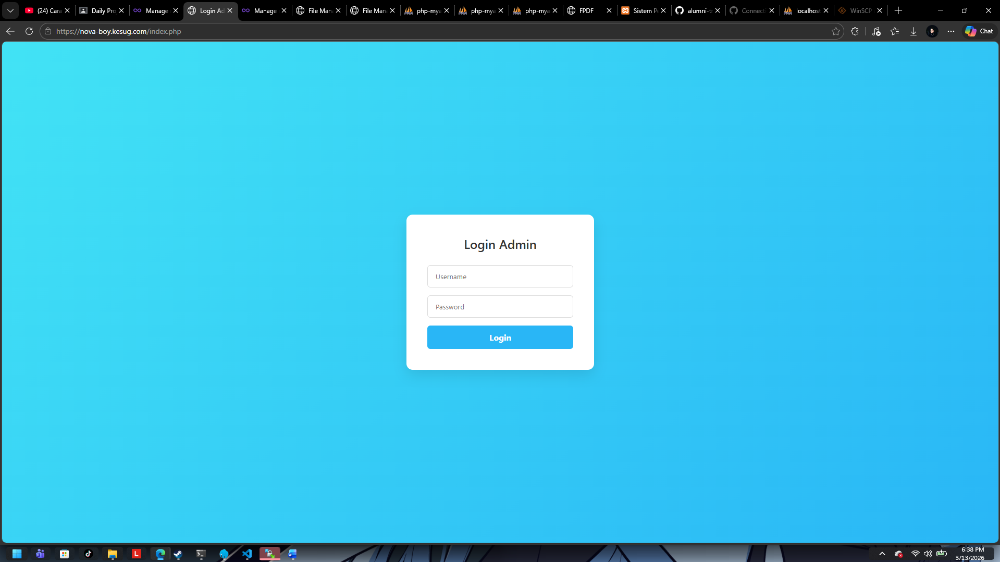
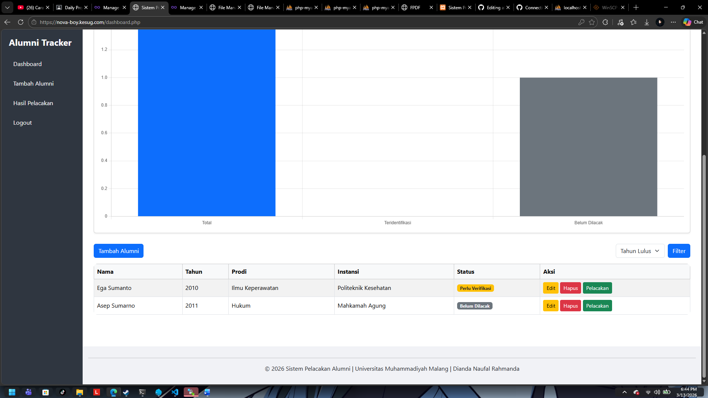
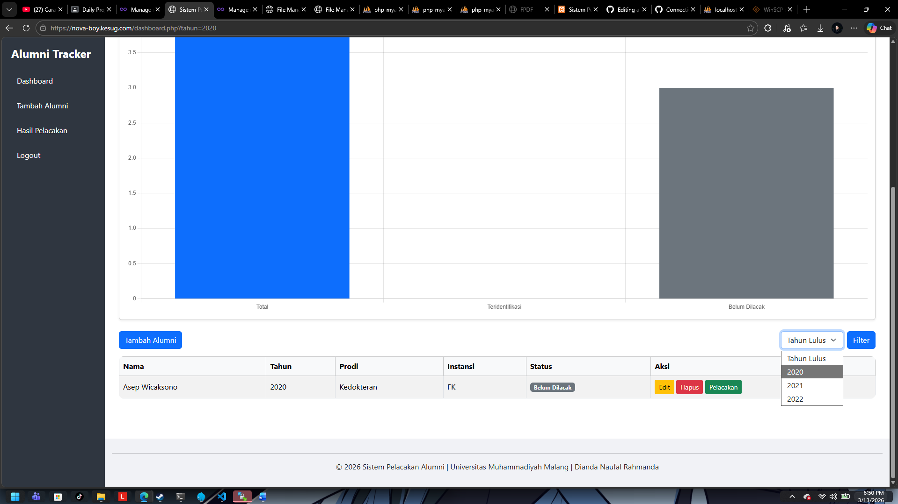
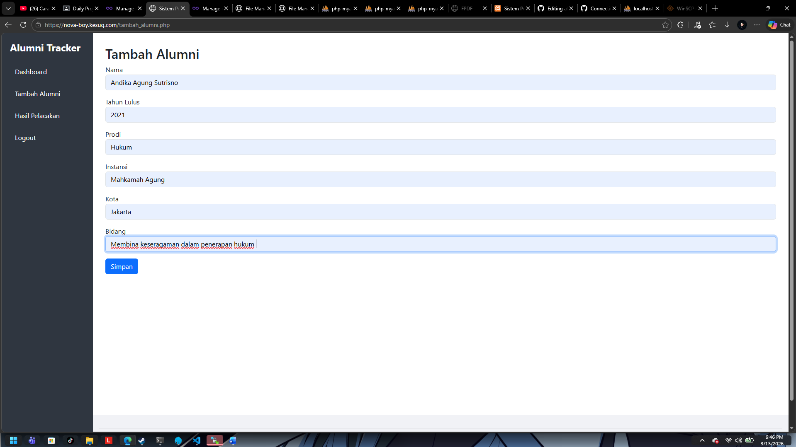
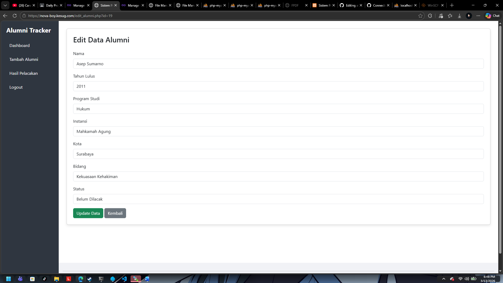
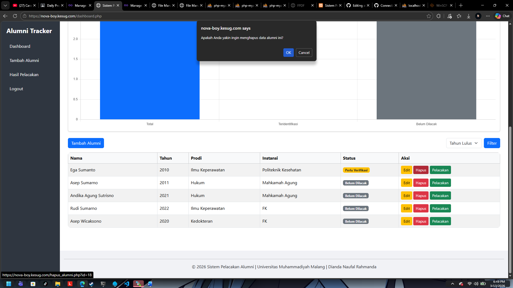
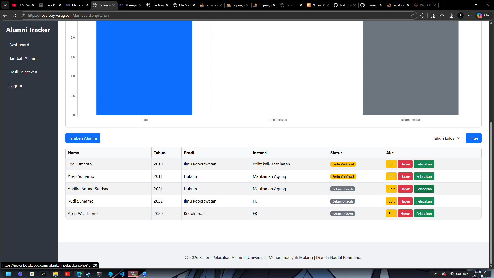
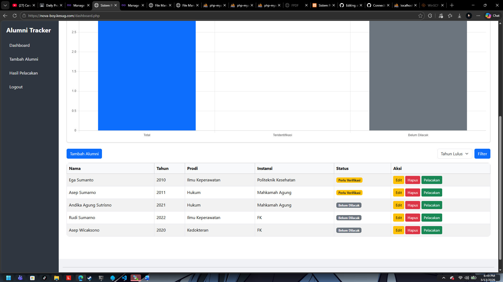
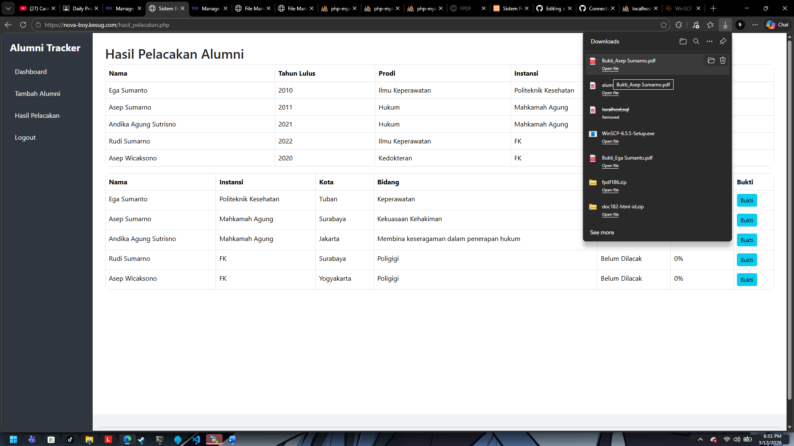
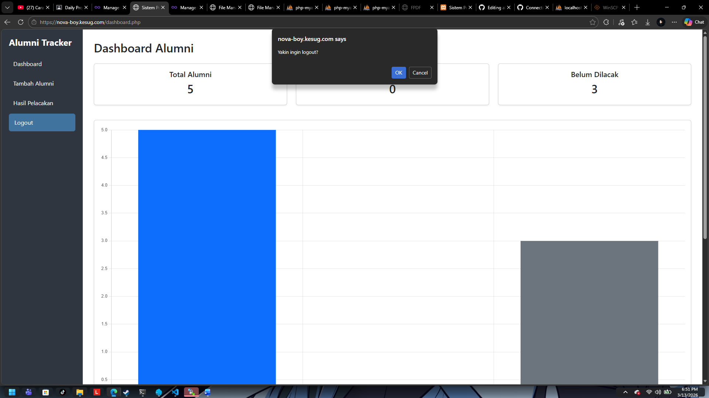

# Alumni Tracking System

Sistem ini dibuat untuk memudahkan pelacakan data alumni, termasuk status mereka, confidence score, dan bukti pelacakan dalam bentuk PDF.  

## Fitur Utama

1. **Dashboard Alumni**
   - Menampilkan total alumni, jumlah teridentifikasi, dan yang belum dilacak.
   - Grafik visualisasi menggunakan Chart.js.

2. **Manajemen Alumni**
   - Tambah alumni baru dengan data: Nama, Tahun Lulus, Prodi, Instansi, Kota, Bidang.
   - Edit data alumni secara lengkap, termasuk status dan confidence score.
   - Hapus data alumni.

3. **Pelacakan Alumni**
   - Jalankan pelacakan per-alumni atau sekaligus.
   - Sistem menghitung `confidence_score` berdasarkan data yang tersedia.
   - Status alumni otomatis diperbarui: Belum Dilacak, Perlu Verifikasi, Teridentifikasi.

4. **Bukti Pelacakan**
   - Generate file PDF untuk masing-masing alumni.
   - PDF berisi: Nama, Instansi, Kota, Bidang, Status, Confidence.
   - Bisa di-download langsung melalui tombol “Bukti” di tabel alumni.

5. **Filter & Pencarian**
   - Filter alumni berdasarkan tahun lulus.
   - Tampilan tabel interaktif dan rapi menggunakan Bootstrap.

## Teknologi yang Digunakan

- PHP
- MySQL / MariaDB
- Bootstrap 5
- Chart.js
- FPDF (untuk generate PDF)

## Cara Penggunaan

1. Clone atau download proyek ini.
2. Import database `alumni` yang sudah disediakan.
3. Letakkan folder `fpdf` di root proyek (untuk generate PDF).
4. Jalankan server lokal (XAMPP, Laragon, WAMP, dsb).
5. Akses `dashboard.php` untuk melihat data alumni.
6. Klik tombol “Jalankan Pelacakan” untuk menghitung confidence score.
7. Klik tombol “Bukti” untuk download PDF hasil pelacakan per-alumni.

## Struktur Folder
alumni-tracking-system/
│
├─ fpdf/                  # Library FPDF untuk generate PDF
│   └─ fpdf.php
│
├─ css/                   # File CSS untuk semua halaman
│   └─ style.css
│
├─ layout/                # Header, Footer, Sidebar
│   ├─ header.php
│   ├─ footer.php
│   └─ sidebar.php
│
├─ index.php              # Bisa dijadikan halaman login utama
├─ dashboard.php
├─ tambah_alumni.php
├─ edit_alumni.php
├─ hapus_alumni.php
├─ jalankan_pelacakan.php
├─ hasil_pelacakan.php
├─ bukti_pelacakan.php
├─ koneksi.php
└─ README.md

# Pengujian Fitur Web Alumni Tracking System

Panduan ini digunakan untuk menguji semua fitur yang ada pada web **Alumni Tracking System**, beserta screenshot untuk referensi visual.

---

## 1. Login Admin
**Langkah:**
1. Buka `index.php`
2. Masukkan username & password valid
3. Klik tombol Login

**Hasil Diharapkan:** Login berhasil dan diarahkan ke dashboard.  
**Screenshot:**  

---

## 2. Dashboard Alumni
**Langkah:** Lihat total alumni, jumlah teridentifikasi, belum dilacak, dan chart bar  
**Hasil Diharapkan:** Semua data sesuai database  
**Screenshot:**  

---

## 3. Filter Tahun
**Langkah:** Pilih tahun tertentu di dropdown dan klik Filter  
**Hasil Diharapkan:** Tabel menampilkan alumni sesuai tahun  
**Screenshot:**  

---

## 4. Tambah Alumni
**Langkah:**  
1. Klik “Tambah Alumni”  
2. Isi data lengkap: Nama, Tahun, Prodi, Instansi, Kota, Bidang  
3. Klik Submit  

**Hasil Diharapkan:** Data tersimpan, status default: Belum Dilacak  
**Screenshot:**  

---

## 5. Edit Alumni
**Langkah:**  
1. Klik tombol Edit pada salah satu alumni  
2. Ubah data & status  
3. Klik Update  

**Hasil Diharapkan:** Data berhasil diubah di database, status muncul sesuai  
**Screenshot:**  

---

## 6. Hapus Alumni
**Langkah:** Klik tombol Hapus dan konfirmasi  
**Hasil Diharapkan:** Data terhapus, tabel diperbarui  
**Screenshot:**  

---

## 7. Jalankan Pelacakan Per Alumni
**Langkah:** Klik tombol pelacakan pada satu alumni  
**Hasil Diharapkan:** Hanya alumni tersebut yang terupdate  
**Screenshot:**  

---

## 8. Hasil Pelacakan
**Langkah:** Klik menu “Hasil Pelacakan Alumni”  
**Hasil Diharapkan:** Semua data terupdate, tombol bukti aktif  
**Screenshot:**  

---

## 9. Download Bukti PDF
**Langkah:** Klik tombol “Bukti” pada alumni  
**Hasil Diharapkan:** File PDF berisi: Nama, Instansi, Kota, Bidang, Status, Confidence  
**Screenshot:**  

---

## 10. Logout
**Langkah:** Klik tombol logout  
**Hasil Diharapkan:** Admin keluar dan diarahkan ke halaman login  
**Screenshot:**  

---

## Credit
Dianda Naufal Rahmanda – 202310370311365  
Universitas Muhammadiyah Malang

## Credit

Dianda Naufal Rahmanda – 202310370311365  
Rekayasa Kebutuhan - A
Universitas Muhammadiyah Malang  

---

> Catatan: Pastikan file `fpdf.php` ada di folder `fpdf` untuk fitur generate PDF berjalan lancar.
